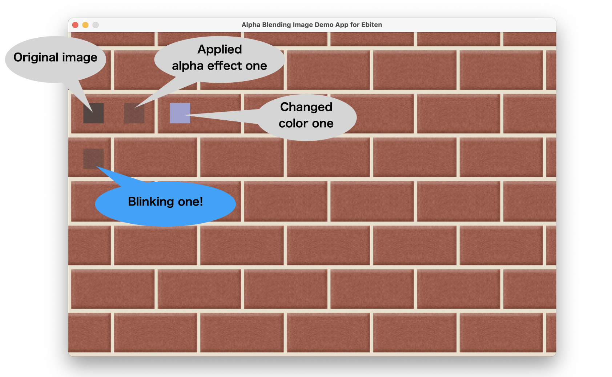

# Blinking image sample

This is a sample for alpha blending images.



- Left upper: original image.
- Center upper: applied alpha effect one.
- Right upper: changed color one.
  - apply [colorM.Translate](https://ebiten.org/documents/cheatsheet.html#(*ebiten.ColorM).Translate)
- Left bottom: blinking one.

## Build and Run

```sh
go run *.go
```
