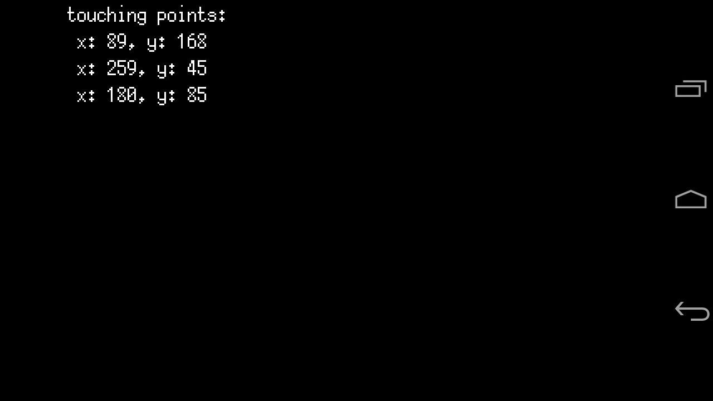

# touch-point

A sample program for getting knowledge for touch operation using the [ebiten](https://github.com/hajimehoshi/ebiten) on a smartphone.

## Sample screen



A Screen capture when multi-touching!

## How to build

After connecting the debugging Android smartphone to the PC, execute the following.

```
gomobile install github.com/kemokemo/ebiten-sketchbook/touch-point
```
