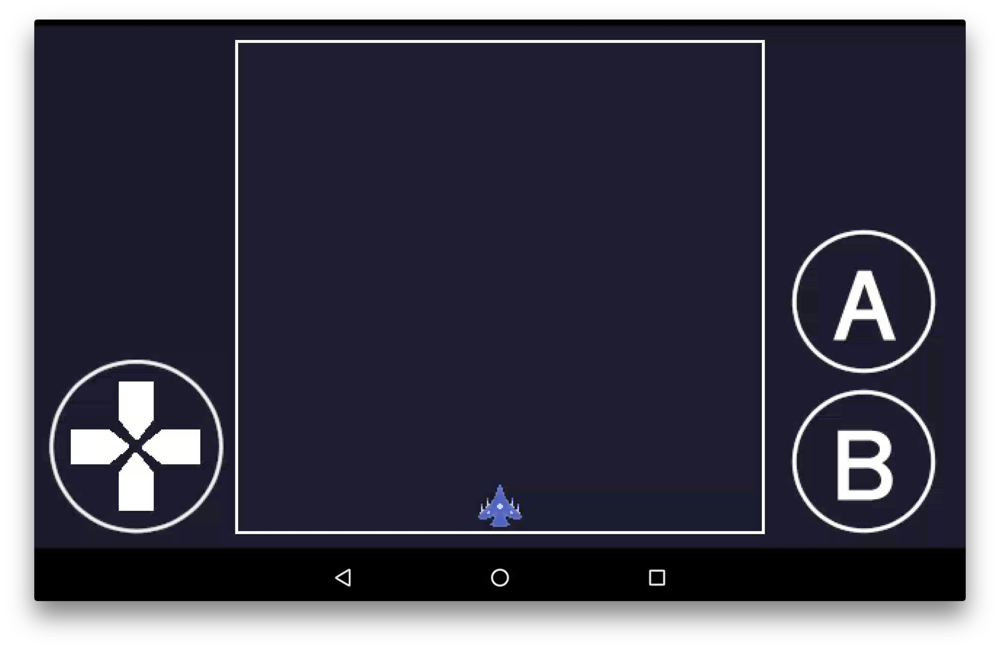

# Virtual Gamepad

Sample for displaying a virtual game pad on the game screen and pressing it to manipulate the character.

## How to Install

```sh
go get -d github.com/kemokemo/ebiten-sketchbook
```

```sh
gomobile install github.com/kemokemo/ebiten-sketchbook/virtual-gamepad
```

## How to control



* Directional pad
  - Move the player character. Eight directions are available.
* A button
  - Change the mode of the player character.
  - Triggered when this button was released.
* B button
  - Shot bullets.
  - Triggered during the press.
